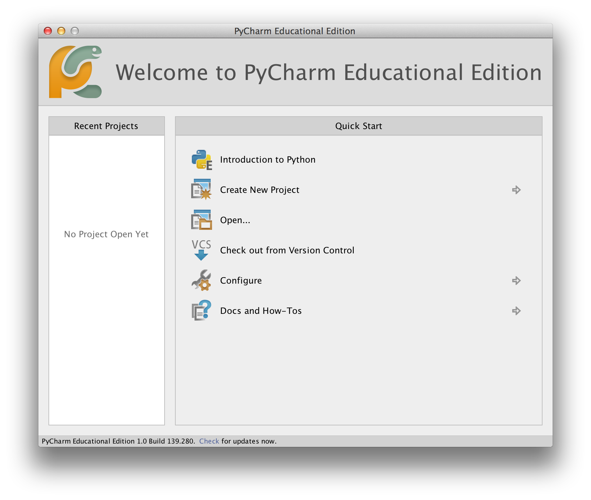
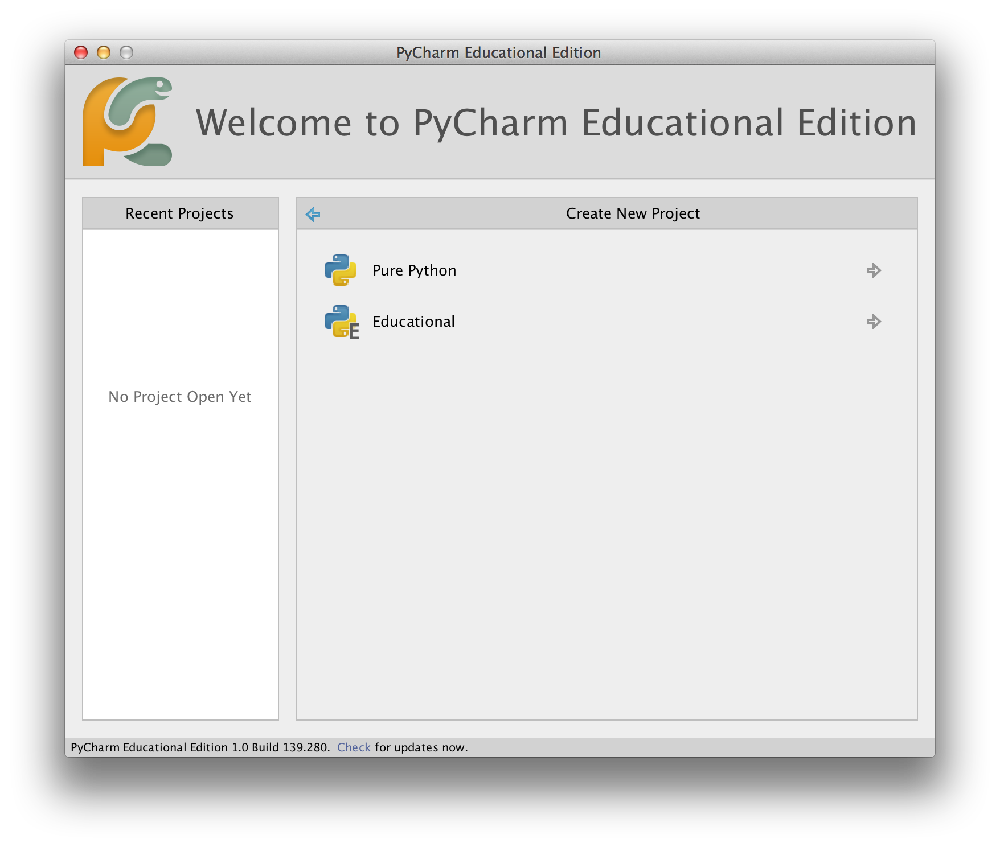
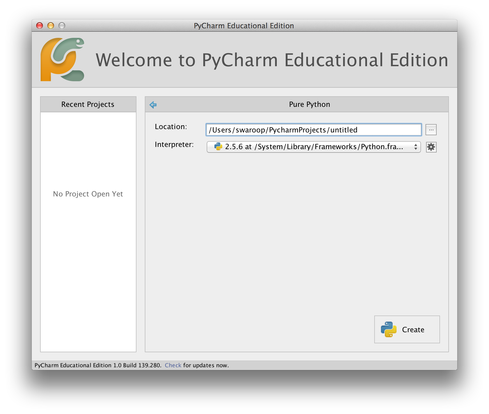
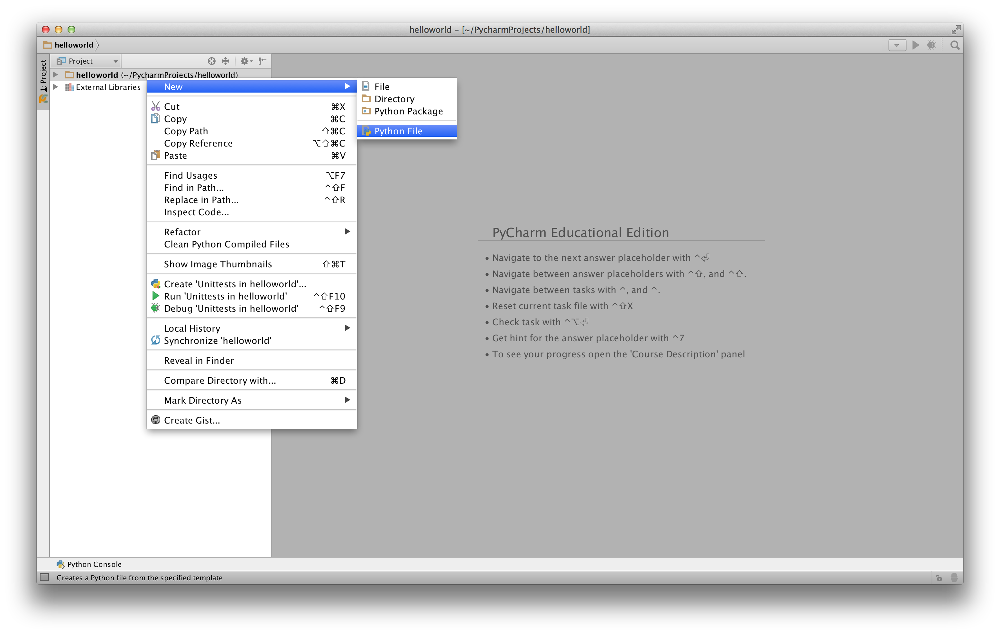
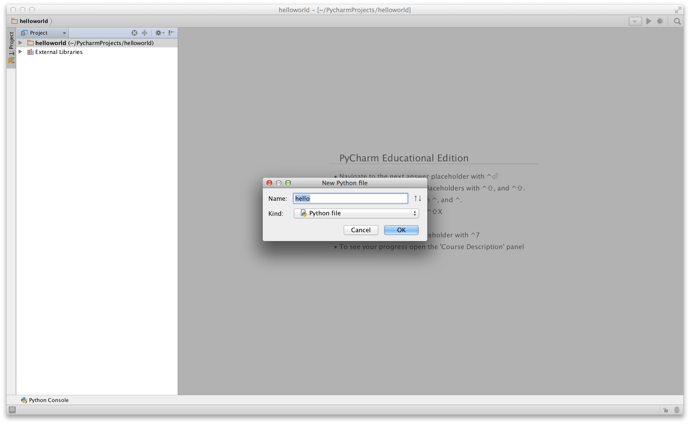
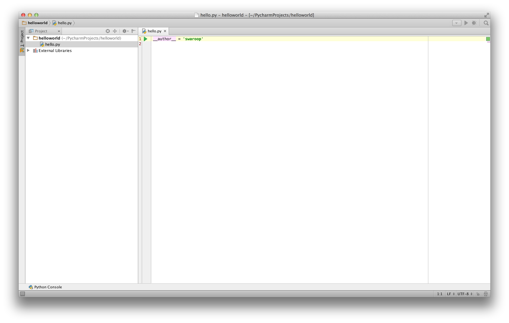
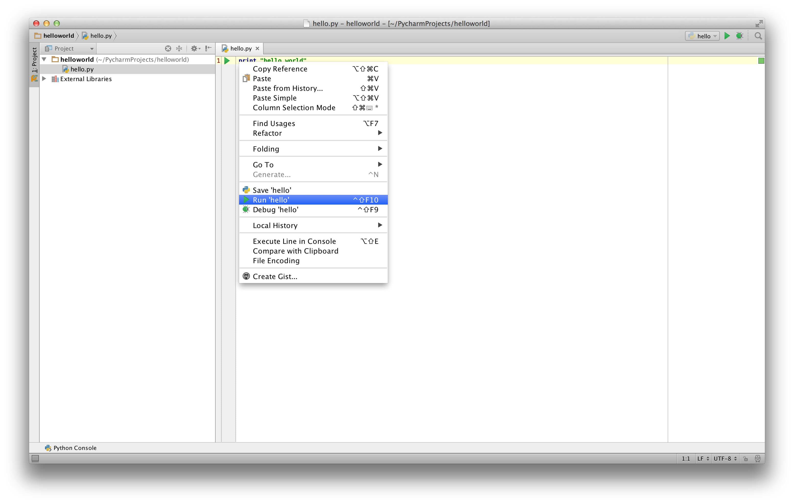
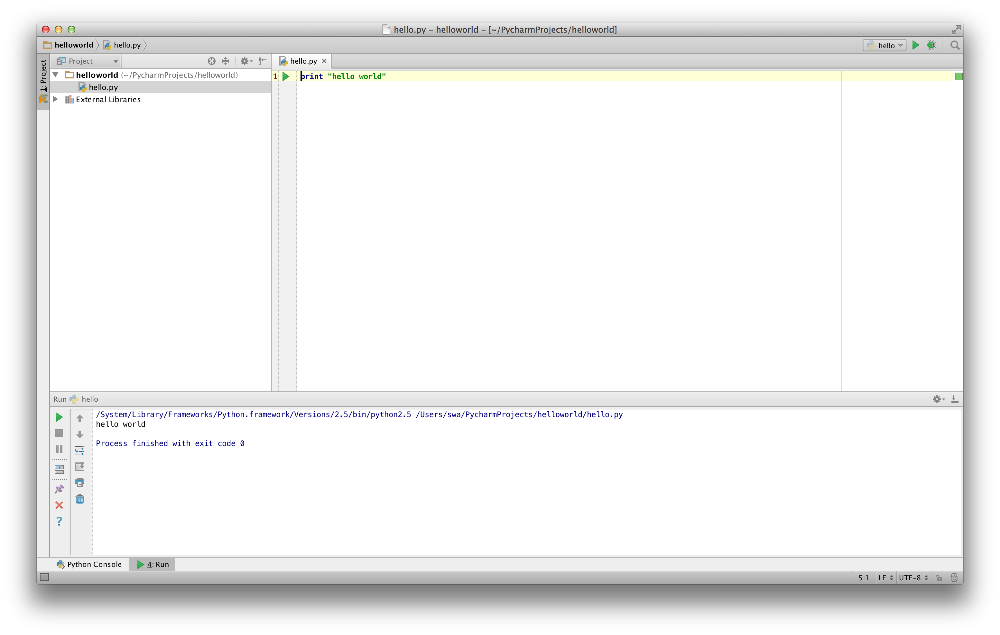
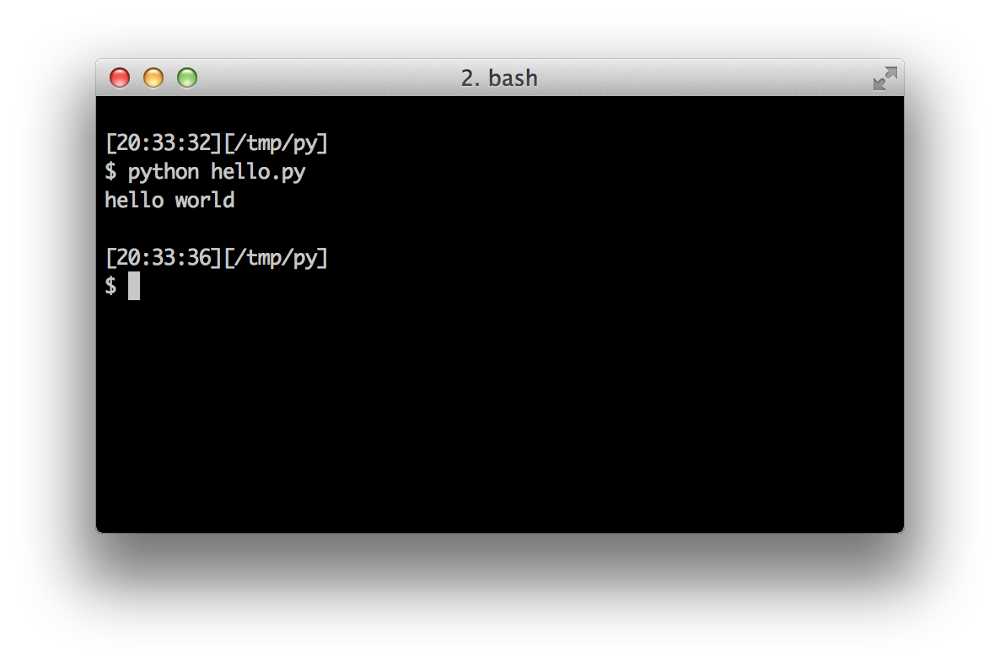

# 第一步

现在我们来看看如何在 Python 中运行传统的"Hello World"程序。这将教你如何编写、保存和运行 Python 程序。

使用 Python 运行程序有两种方式——使用交互式解释器提示符或使用源文件。我们现在来看看如何使用这两种方法。

## 使用解释器提示符

打开你操作系统中的终端（如前面[安装](./installation.md#installation)章节所述），然后输入 `python3` 并按 `[回车]` 键来打开 Python 提示符。

启动 Python 后，你应该会看到 `>>>`，在这里你可以开始输入内容。这被称为 _Python 解释器提示符_。

在 Python 解释器提示符中，输入：

```python
print("Hello World")
```

然后按 `[回车]` 键。你应该会在屏幕上看到 `Hello World` 字样。

以下是你应该看到的示例，使用的是 Mac OS X 计算机。Python 软件的详细信息会因你的计算机而异，但从提示符开始的部分（即从 `>>>` 开始）在任何操作系统上都应该是一样的。

<!-- The output should match pythonVersion variable in book.json -->
```python
$ python3
Python 3.6.0 (default, Jan 12 2017, 11:26:36)
[GCC 4.2.1 Compatible Apple LLVM 8.0.0 (clang-800.0.38)] on darwin
Type "help", "copyright", "credits" or "license" for more information.
>>> print("Hello World")
Hello World
```

注意 Python 会立即给你输出结果！你刚才输入的是一个 Python _语句_。我们使用 `print` 来（不出所料地）打印你提供给它的任何值。在这里，我们提供了文本 `Hello World`，它立即被打印到了屏幕上。

### 如何退出解释器提示符

如果你使用的是 GNU/Linux 或 OS X 的 shell，可以按 `[ctrl + d]` 或输入 `exit()`（注意：记得包含括号 `()`）然后按 `[回车]` 键来退出解释器提示符。

如果你使用的是 Windows 命令提示符，按 `[ctrl + z]` 然后按 `[回车]` 键。

## 选择编辑器

我们不能每次想运行程序时都在解释器提示符中输入，所以我们需要将程序保存在文件中，这样可以运行任意次数。

要创建 Python 源文件，我们需要一个可以输入和保存的编辑器软件。一个好的程序员编辑器会让编写源文件变得更加轻松。因此，选择编辑器至关重要。你需要像挑选要买的汽车一样来选择编辑器。一个好的编辑器能帮助你轻松编写 Python 程序，让你的旅途更加舒适，并帮助你更快、更安全地到达目的地（实现你的目标）。

一个最基本的要求是_语法高亮_——将 Python 程序的不同部分用不同颜色显示，这样你就能_看到_你的程序并可视化它的运行。

如果你不知道从哪里开始，我推荐使用 [PyCharm Educational Edition](https://www.jetbrains.com/pycharm-edu/)，它可以在 Windows、Mac OS X 和 GNU/Linux 上使用。详情见下一节。

如果你使用 Windows，*不要使用记事本*——这是一个糟糕的选择，因为它没有语法高亮功能，更重要的是它不支持文本缩进，而缩进在我们的情况下非常重要（我们后面会看到）。好的编辑器会自动处理缩进。

如果你是一名有经验的程序员，那么你一定已经在使用 [Vim](http://www.vim.org) 或 [Emacs](http://www.gnu.org/software/emacs/) 了。毫无疑问，这是两个最强大的编辑器，使用它们编写 Python 程序会给你带来很大好处。我个人在大多数程序中都使用这两个编辑器，甚至还写过一本[关于 Vim 的完整书]({{ book.vimBookUrl }})。

如果你愿意花时间学习 Vim 或 Emacs，我强烈推荐你学习使用其中之一，因为从长远来看它会非常有用。不过，正如我之前提到的，初学者可以从 PyCharm 开始，把学习精力集中在 Python 上，而不是编辑器上。

再次强调，请选择一个合适的编辑器——它可以让编写 Python 程序变得更加有趣和轻松。

如果你对这个话题的详细讨论感兴趣，请查看 [Finding the Perfect Python Code Editor](https://realpython.com/courses/finding-perfect-python-code-editor/)。

## PyCharm {#pycharm}

[PyCharm Educational Edition](https://www.jetbrains.com/pycharm-edu/) 是一个免费的编辑器，你可以用它来编写 Python 程序。

打开 PyCharm 时，你会看到如下界面，点击 `Create New Project`：



选择 `Pure Python`：



将 `untitled` 改为 `helloworld` 作为项目位置，你应该会看到类似以下的详细信息：



点击 `Create` 按钮。

在侧边栏中右键点击 `helloworld`，选择 `New` -> `Python File`：



你会被要求输入文件名，输入 `hello`：



现在你可以看到一个文件已经为你打开了：



删除已有的行，然后输入以下内容：

<!-- TODO: Update screenshots for Python 3 -->

```python
print("hello world")
```
现在右键点击你输入的内容（不需要选中文本），然后点击 `Run 'hello'`。



你现在应该能看到程序的输出（打印的内容）：



呼！启动的步骤确实不少，但从现在开始，每次我们要求你创建新文件时，记住只需右键点击左侧的 `helloworld` -> `New` -> `Python File`，然后按照上面展示的相同步骤输入和运行即可。

你可以在 [PyCharm Quickstart](https://www.jetbrains.com/pycharm-educational/quickstart/) 页面找到更多关于 PyCharm 的信息。

## Vim

1. 安装 [Vim](http://www.vim.org)
    * Mac OS X 用户应通过 [HomeBrew](http://brew.sh/) 安装 `macvim` 包
    * Windows 用户应从 [Vim 网站](http://www.vim.org/download.php) 下载"自安装可执行文件"
    * GNU/Linux 用户应从其发行版的软件仓库获取 Vim，例如 Debian 和 Ubuntu 用户可以安装 `vim` 包
2. 安装 [jedi-vim](https://github.com/davidhalter/jedi-vim) 插件以实现自动补全
3. 安装对应的 `jedi` Python 包：`pip install -U jedi`

## Emacs

1. 安装 [Emacs 24+](http://www.gnu.org/software/emacs/)。
    * Mac OS X 用户应从 http://emacsformacosx.com 获取 Emacs
    * Windows 用户应从 http://ftp.gnu.org/gnu/emacs/windows/ 获取 Emacs
    * GNU/Linux 用户应从其发行版的软件仓库获取 Emacs，例如 Debian 和 Ubuntu 用户可以安装 `emacs24` 包
2. 安装 [ELPY](https://github.com/jorgenschaefer/elpy/wiki)

## 使用源文件

现在让我们回到编程。有一个传统：每当你学习一门新的编程语言时，你编写和运行的第一个程序就是"Hello World"程序——它所做的就是在运行时输出"Hello World"。正如 Simon Cozens[^1] 所说，这是"向编程之神献上的传统咒语，帮助你更好地学习这门语言。"

启动你选择的编辑器，输入以下程序并将其保存为 `hello.py`。

如果你使用 PyCharm，我们已经[讨论过如何从源文件运行](#pycharm)。

对于其他编辑器，打开一个新文件 `hello.py` 并输入：

```python
print("hello world")
```

你应该把文件保存在哪里？保存在你知道位置的任何文件夹中。如果你不理解这是什么意思，创建一个新文件夹，并用该位置来保存和运行你所有的 Python 程序：

- Mac OS X 上：`/tmp/py`
- GNU/Linux 上：`/tmp/py`
- Windows 上：`C:\py`

要创建上述文件夹（针对你使用的操作系统），在终端中使用 `mkdir` 命令，例如 `mkdir /tmp/py`。

重要：始终确保你给文件加上 `.py` 扩展名，例如 `foo.py`。

要运行你的 Python 程序：

1. 打开一个终端窗口（参见前面的[安装](./installation.md#installation)章节了解如何操作）
2. **切换目录**到你保存文件的位置，例如 `cd /tmp/py`
3. 输入命令 `python hello.py` 来运行程序。输出如下所示。

```
$ python hello.py
hello world
```



如果你得到了如上所示的输出，恭喜！——你已经成功运行了你的第一个 Python 程序。你已经成功跨越了学习编程最困难的部分——启动你的第一个程序！

如果你遇到了错误，请_完全按照_上面的程序重新输入并再次运行。注意 Python 是区分大小写的，即 `print` 和 `Print` 是不一样的——注意前者是小写的 `p`，后者是大写的 `P`。此外，确保每行第一个字符之前没有空格或制表符——我们稍后会看到[为什么这很重要](./basics.md#indentation)。

**工作原理**

Python 程序由_语句_组成。在我们的第一个程序中，只有一个语句。在这个语句中，我们调用了 `print` _语句_，并提供了文本"hello world"。

## 获取帮助

如果你需要快速了解 Python 中任何函数或语句的信息，可以使用内置的 `help` 功能。这在使用解释器提示符时特别有用。例如，运行 `help('len')`——这会显示 `len` 函数的帮助信息，该函数用于计算项目的数量。

提示：按 `q` 退出帮助。

同样，你可以获取 Python 中几乎任何东西的信息。使用 `help()` 来了解更多关于 `help` 本身的用法！

如果你需要获取像 `return` 这样的运算符的帮助，你需要将其放在引号中，如 `help('return')`，这样 Python 就不会对你想要做什么感到困惑。

## 总结

你现在应该能够轻松地编写、保存和运行 Python 程序了。

既然你已经是一名 Python 用户了，让我们来学习更多 Python 的概念吧。

---

[^1]: 《Beginning Perl》一书的作者
